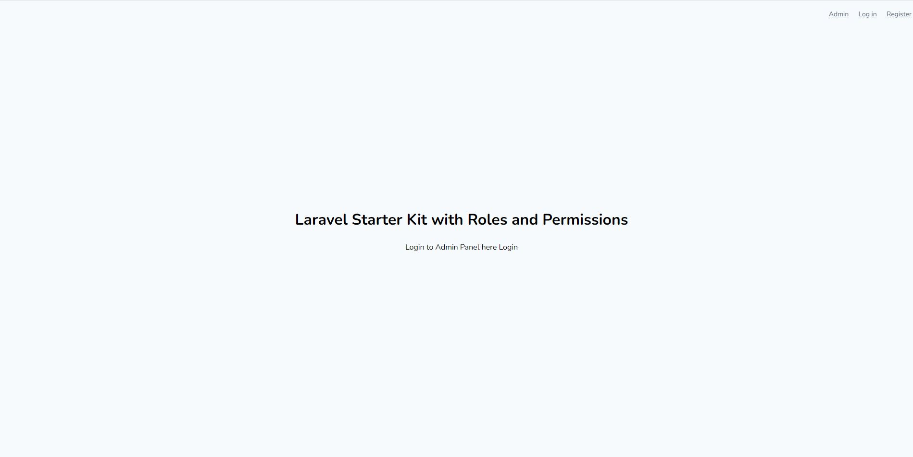
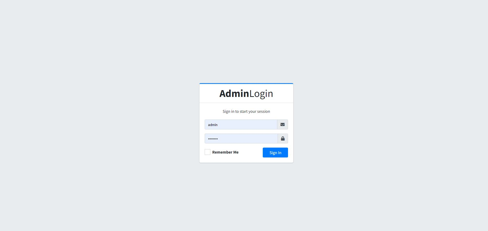
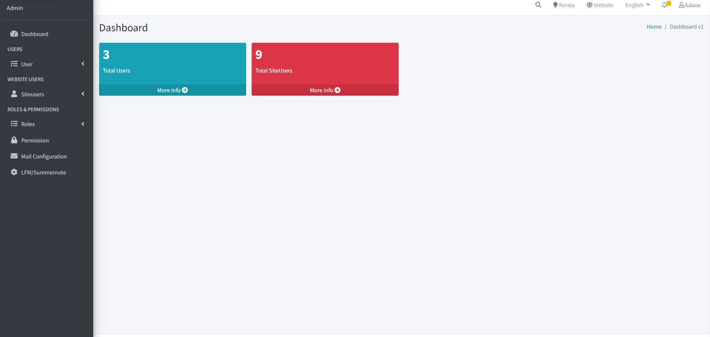

<h4>Laravel Starter Kit with Localization | Payment Gateway Module | Role and Permissions</h4>

## About This Starter Lit

Features In this Starter Kit

-   Multiple Localization Support
-   Roles and Permissions
-   Laravel File Manager Included
-   Paypal Payment Gateway Included
-   Location Facility

Laravel is accessible, powerful, and provides tools required for large, robust applications.

## How to Run Project

### `clone the repository`

install Dependencies

### `composer install`

install Npm Dependencies

### `npm install && npm run dev`

Run Migartion and Seeder Files

### `php artisan migrate:fresh --seed`

Run Server

### `php artisan serve`

Note \*

### `Before run seeder go to MailConfigSeeder file and Update Your Mail Configuration`

Some ScreenShots

## Front Page

## Admin Login

## Dashboard

## LFM

## License

@jk.
